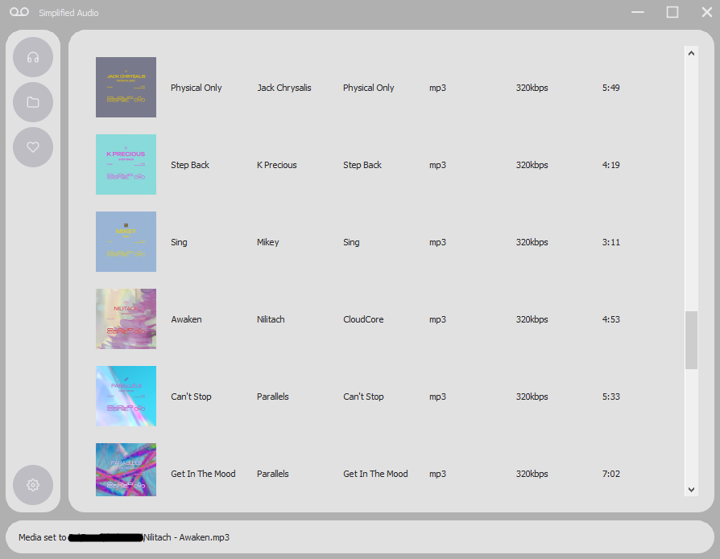

# Simplified Audio

Multi-format audio player written in **Python** using **PyQt5** and **Mutagen**.

## Features
 - The application handles **metadata** display of various music formats, such as **mp3, wav, flac**.
 - You can **like a track**, then acces it faster in the 'liked' section.
 - **Mass import** of tracks is supported.
 - **Album cover** display
 - **Light/Dark** theme
 - **Next/Previous** song
 - **Mute/Unmute**
 - **Skip** to a part of the song using the slider
 - Imported song section, with **minimized display** of the album cover
	
The playback capability depends on the underlying multimedia framework that is installed on your system. 

Additional codec installation might be reuqired.

## How to use
At first start, you have to specify a folder to import from, in the settings section on the bottom left corner.

After that, the imported songs will be stored in a database, no need
for importing multiple times.

## Credit

- [Feather Icons](https://feathericons.com/)

 	
